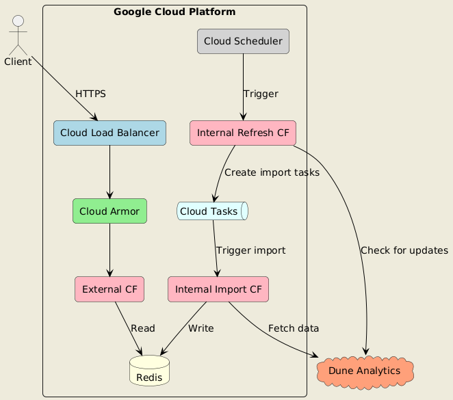

# MiniPay Airdrop

MiniPay Airdrop is a project designed to manage and distribute airdrop allocations. It consists of a set of APIs and services that interact with Dune Analytics and Redis to store and retrieve allocation data.

## Project Structure

The project is structured as follows:

- `src/`: Contains the main source code
  - `entry/`: Entry points for external and internal APIs
  - `operations/`: Business logic for handling allocations, imports, and refreshes
  - `services/`: Interfaces with external services (Redis, Dune, Google Cloud Tasks)
  - `dev/`: Development and testing utilities
  - `schema.ts`: Defines data schemas
  - `constants.ts`: Project-wide constants
  - `utils.ts`: Utility functions
- `infra/`: Contains Terraform scripts for infrastructure provisioning

## Local Development

There are two main paths for local development, depending on your role and needs:

### For Frontend Engineers

If you're a frontend engineer or just need to interact with the API:

1. Install dependencies:

   pnpm install

2. Run the mock server:

   pnpm run dev:mock-server

3. Once the server is running, you can access the Swagger OpenAPI specification at:

   http://localhost:3000/docs

   This provides an interactive documentation of the API endpoints, making it easy to understand and test the API without setting up the full backend infrastructure.

4. The mock API supports various test scenarios and failure modes. You can trigger these by using specific addresses when calling the API. For example:

   - `0xb873Bb7e3B723C49B9516566a0B150bbfe1E1Dac` will return a 403 Forbidden error
   - `0x11815DeF716bFC4a394a32Ea41a981f3aC56D0d9` will be rate limited 50% of the time
   - `0xc9D04AFEa3d50632Cd0ad879E858F043d17407Ae` will fail with a 500 Internal Server Error
   - `0x556DDc9381dF097C4946De438a4272ECba26A496` will return an empty allocation

   These test scenarios are fully documented in the Swagger specification, allowing you to easily test different API behaviors and error handling in your frontend application.

### For Backend Development

If you're developing the actual package:

1. Install dependencies:

   pnpm install

2. Set up environment variables:
   Create a `.env.local` file with the necessary environment variables (DUNE_API_KEY, REDIS_URL, etc.)

3. Ensure Docker is installed on your system, as it's required for running the development services.

4. Choose one of the following streamlined development commands:

   pnpm run dev:stream

   or for a TUI (Text User Interface) experience:

   pnpm run dev:tui

   These commands are persistent watch commands that run several processes concurrently:

   - `dev:services`: Starts the required Docker containers (Redis, Cloud Tasks Emulator)
   - `dev:internal`: Runs the internal API with live reloading
   - `dev:external`: Runs the external API with live reloading
   - `dev:create-queue`: Sets up the development task queue
   - `build:watch`: Watches for TypeScript changes and recompiles as needed

   The TUI version provides a text-based dashboard for monitoring all these processes.

Both development paths will automatically update and reload as you make changes to the code, providing a smooth development experience.

## Application Logic

The MiniPay Airdrop application consists of three main operations: refresh, import, and allocation retrieval. Here's how each of these operations works:

### Refresh Operation

1. It queries Dune Analytics for the latest execution of the airdrop query and then tries to fetch the execution from its database (redis).
2. If the execution doesn'exist in the database, it starts a new import process. For an existing execution, it only starts a new import if:
   - The current import is not finished, AND
   - The current import is older than 30 minutes (considered stale)
3. If neither of these conditions are met, it returns a "Service Unavailable" response.
4. The operation also checks and updates airdrop statistics (total recipients, total MENTO allocated, etc.).
5. If a new import is needed, it schedules import tasks using Google Cloud Tasks.

### Import Operation

1. It's triggered by tasks created during the refresh operation.
2. Each task imports a batch of allocation data (default batch size is 30,000 records).
3. The imported data is stored in Redis with keys in the format `allocation:{executionId}:{address}`.
4. The operation keeps track of the number of rows imported and updates the execution status.
5. Once all batches are imported, it marks the import as finished.

### Allocation Retrieval Operation

1. When a request comes in, it first checks for the latest completed execution in Redis.
2. Using the execution ID and the requested address, it retrieves the allocation data from Redis.
3. If no allocation is found for the address, it returns a 404 error.
4. If found, it calculates the final MENTO allocation based on the user's transfers and holdings:
   - MENTO from transfers = min(10% of amount transferred, 100)
   - MENTO from holdings = min(average amount held, 100)
5. The total allocation, along with a breakdown by task (hold and transfer), is returned to the user.

These operations work together to ensure that the airdrop data is regularly updated and efficiently served to users. The use of Redis as a cache helps in quick data retrieval, while the batch import process allows for handling large datasets without overwhelming the system.

## Infrastructure

The MiniPay Airdrop project leverages Google Cloud Platform (GCP) for its infrastructure. The infrastructure is provisioned using Terraform scripts located in the `infra/` directory. Below is a detailed overview of the system architecture:

### Core Components

1. **Google Cloud Load Balancer**: Serves as the entry point for client requests, handling traffic distribution and SSL termination.

2. **Cloud Armor**: Sits behind the load balancer, providing security policies and DDoS protection.

3. **Google Cloud Functions**:

   - **External CF**: Hosts the external API for allocation retrieval.
   - **Internal Refresh CF**: Handles the refresh process, checking for updates from Dune Analytics.
   - **Internal Import CF**: Manages the import process, fetching and storing data.

4. **Redis**: Used for caching and storing allocation data.

5. **Cloud Tasks**: Manages the queue for import tasks, triggered by the Internal Refresh CF.

6. **Cloud Scheduler**: Triggers the Internal Refresh CF periodically to check for updates.

### External Services

- **Dune Analytics**: External data source for airdrop allocations.

### Key Interactions

1. Clients interact with the system through the Cloud Load Balancer via HTTPS.
2. Cloud Armor protects against attacks before requests reach the External CF.
3. The External CF retrieves allocation data from Redis to serve client requests.
4. Cloud Scheduler periodically triggers the Internal Refresh CF.
5. The Internal Refresh CF checks Dune Analytics for updates and creates import tasks in Cloud Tasks if necessary.
6. Cloud Tasks triggers the Internal Import CF to process these tasks.
7. The Internal Import CF fetches data from Dune Analytics and stores it in Redis.

### Terraform Modules

1. **build**: Handles the local build process, creating a zip package for deployment.
2. **cloud-function**: A reusable module for deploying Cloud Functions.
3. **lb-http**: Sets up the HTTP(S) load balancer.
4. **security_policy**: Configures Cloud Armor security policies.

This architecture ensures scalability, security, and efficient data processing for the MiniPay Airdrop system. The use of managed GCP services minimizes operational overhead while providing robust performance and reliability.

## Deployment

This section describes how to deploy the MiniPay Airdrop infrastructure using Terraform while impersonating a Google Cloud service account. This method allows for secure, local deployments without the need for long-lived credential files.

### Prerequisites

1. [Terraform](https://www.terraform.io/downloads.html) (version 1.9.2 or later)
2. [Google Cloud SDK](https://cloud.google.com/sdk/docs/install)
3. Access to the Google Cloud project `mento-prod` with the necessary APIs enabled

### Setup

1. Ensure you're logged into the Google Cloud SDK:

   gcloud auth login

2. Set your active project:

   gcloud config set project mento-prod

### Deployment Steps

1. Navigate to the `infra/` directory:

   cd infra

2. Initialize Terraform:

   terraform init

3. Impersonate the service account:

   gcloud auth application-default login --impersonate-service-account=terraform@mento-prod.iam.gserviceaccount.com

4. Plan the Terraform deployment:

   terraform plan -out=tfplan

5. Review the plan carefully to ensure it matches your expectations.

6. Apply the Terraform plan:

   terraform apply tfplan

7. Once the deployment is complete, Terraform will output important information such as function URLs and other resource identifiers.

By following these steps, you can securely deploy the MiniPay Airdrop infrastructure using Terraform while impersonating the designated Google Cloud service account. This method provides a balance between security and ease of use for local deployments.
